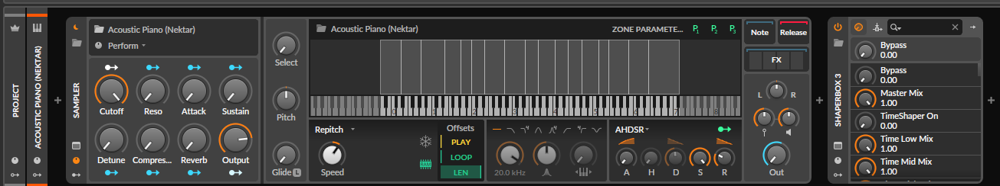
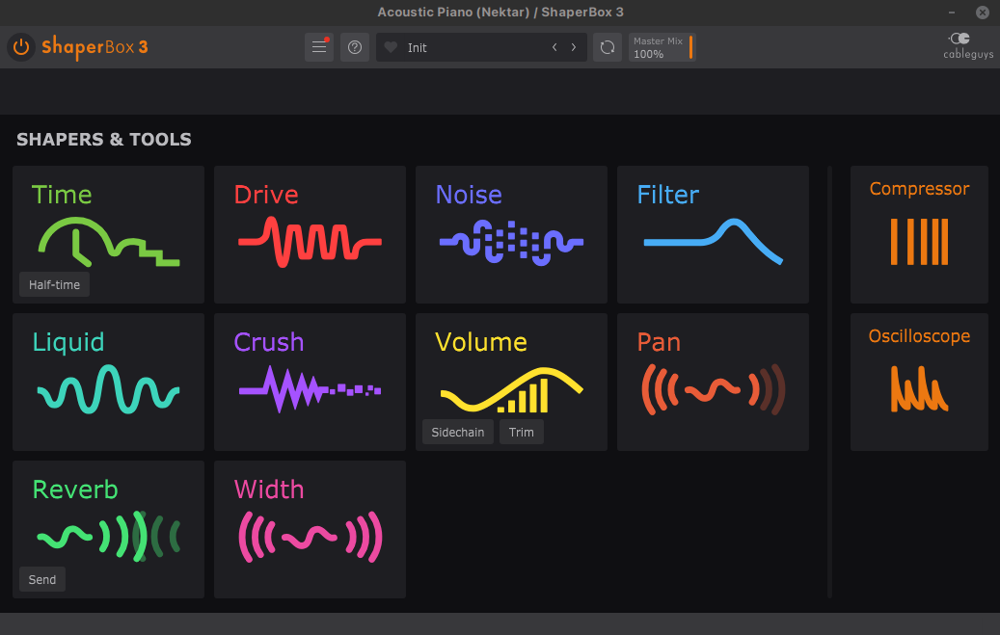
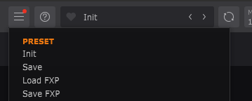

# Getting started
You can use this module to record and play back mouse and keyboard events.

# Preparation
_Tested only on Linux with Bitwig and yabridge._

1. Open DAW and put Shaperbox on lane

2. Open shaperbox window
3. In target folder with presets for simplicity copy any preset as "1.fxp"
4. In shaperbox, Open "Load FXP" dialog from shaperbox naviate to target folder and type "1", press enter
5. Check if everything is ok - preset name should be reflected in shaperbox window
6. Do not close Shaperbox or DAW, do not move windows. Preferably don't have other open windows
7. Do not move your mouse or press any keys
8. Run `record.py` and press `F8` to start recording
9. Repeat steps 4-5
10. .Move mouse to Shaperbox window, in menu select "Save"
11. In opened window move mouse to "Save" button and click it
12. Press `F8` to stop recording
13. Open `recorded_automation.json` file and check if everything looks ok
14. At the top, before `steps` add following lines:
```
  "window_title": "ShaperBox 3",
  "file_dialog_title": "Load FXP",
  "file_directory": "/home/kartun/Documents/shaperbox_tmp/1",
  "file_extension": ".fxp",
```
15. Adjust to path where you saved your presets (simplier is better, like c:\temp\shaper_presets)
16. Run `automate.py`, let it run for a while, do not touch mouse or keyboard (it may take lots of time)
17. Manually delete duplicates in presets, if needed
